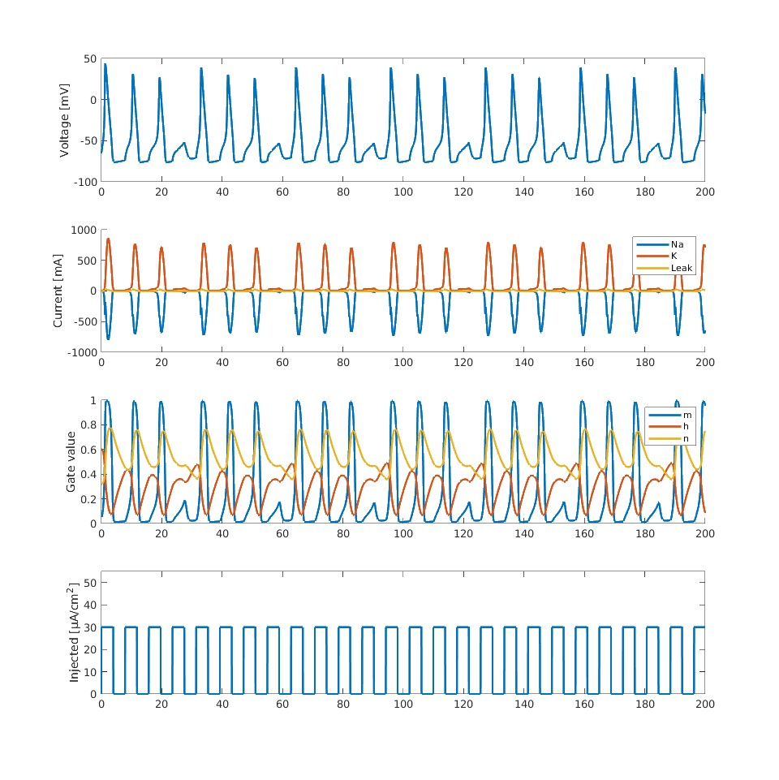

# Hodgkin-Huxley Model

## Overview

This was a project I did as part of my final project for Simulation Engineering class in my university. This is written in MATLAB.

I simulated the Hodgkin-Huxley model in Computational Neuroscience.

### What is Hodgkin-Huxley model
This is a page describing Hodgkin-Huxley model. \
[EN](https://neuronaldynamics.epfl.ch/online/Ch2.S2.html) / [JP](https://bsd.neuroinf.jp/wiki/Hodgkin-Huxley%E6%96%B9%E7%A8%8B%E5%BC%8F)

## Usage

1. Install [MATLAB](https://mathworks.com/products/matlab.html)

2. Clone this repository.

3. Run below.

```bash
cd hodgkin-huxley-model/src
main
```

## Expected result



ToDo: Write!!
